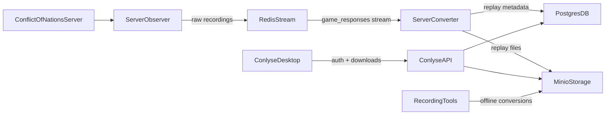

# Conlyse

**Conlyse** is a full-stack system for **recording, storing, and analyzing Conflict of Nations game replays**. It includes a live recording pipeline, an API and backend services, an interactive desktop client, and tooling for offline conversion and analysis.

This README gives a high-level overview of the repository and how the main pieces fit together. For details about individual services and tools, follow the links to their dedicated READMEs.

---

## Architecture overview

At a high level, the stack looks like this:

- **Server Observer** discovers and records live games, writing raw recordings and optionally publishing responses to a Redis stream.
- **Server Converter** consumes responses from Redis, builds replay databases, and updates metadata in PostgreSQL while optionally mirroring data to S3-compatible storage (MinIO).
- **Conlyse API** sits on top of PostgreSQL and MinIO to provide authentication, RBAC, device management, and download endpoints.
- **Conlyse Desktop** consumes the generated replays for interactive analysis or offline processing.



---

## Repository layout

The most important top-level directories and files are:

- **apps/desktop**: Conlyse desktop client (PySide6 + OpenGL) for interactive replay analysis. See [`apps/desktop/README.md`](apps/desktop/README.md).
- **apps/docs**: Documentation for the entire stack. See [`apps/docs/README.md`](apps/docs/README.md).
- **libs/conflict_interface**: Core Python library for interacting with Conflict of Nations game state, replay files, and related data types. See [`libs/conflict_interface/README.md`](libs/conflict_interface/README.md).
- **services/api**: FastAPI-based Conlyse API providing authentication, 2FA, RBAC, device management, and download endpoints. See [`services/api/README.md`](services/api/README.md).
- **services/server_observer**: Headless Rust service that discovers games, manages recording sessions, and writes recordings and optional Redis events. See [`services/server_observer/README.md`](services/server_observer/README.md).
- **services/server_converter**: Daemon that consumes responses from Redis streams, builds replays, and updates replay metadata in PostgreSQL/S3. See [`services/server_converter/README.md`](services/server_converter/README.md).
- **tools/recording_converter**: CLI for converting local recorder output into replays or structured JSON dumps. See [`tools/recording_converter/README.md`](tools/recording_converter/README.md).
- **infra**: Docker Compose files and environment-specific configuration for running the full stack in development and production. See [`infra/docker-compose.yml`](infra/docker-compose.yml) and `infra/dev` / `infra/prod`.
- **scripts**: Utility scripts, including helpers for batch conversion and automation.

Other directories (such as `.github`, tests, and example scripts) provide CI workflows, testing, and usage examples for the underlying libraries and services.

---

## Getting started

### Run the full stack with Docker Compose

The fastest way to try the full ConflictInterface stack is via Docker Compose from the repository root:

```bash
cp .env.example .env        # configure PostgreSQL, Redis, MinIO, API secrets, etc.
docker compose -f infra/docker-compose.yml up -d
```

Once the stack is healthy:

- Conlyse API: `http://localhost:8000` (OpenAPI docs at `/docs`, ReDoc at `/redoc`)
- MinIO Console: `http://localhost:9001`
- PostgreSQL: `localhost:5432` (`replays` database)
- Redis: `localhost:6379`

For full deployment details and environment variables, see [`Deployment.md`](apps/docs/docs/user-guide/deployment.md).
