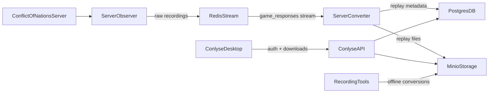

# Conlyse

**Conlyse** is a full-stack system for **recording, storing, and analyzing Conflict of Nations game replays**. It includes a live recording pipeline, an API and backend services, an interactive desktop client, and tooling for offline conversion and analysis.

This README gives a high-level overview of the repository and how the main pieces fit together. For details about individual services and tools, follow the links to their dedicated READMEs.

---

## Architecture overview

At a high level, the stack looks like this:

- **Server Observer** discovers and records live games, writing raw recordings and optionally publishing responses to a Redis stream.
- **Server Converter** consumes responses from Redis, builds replay databases, and updates metadata in PostgreSQL while optionally mirroring data to S3-compatible storage (MinIO).
- **Conlyse API** sits on top of PostgreSQL and MinIO to provide authentication, RBAC, device management, and download endpoints.
- **Conlyse Desktop** and other tools consume the generated replays for interactive analysis or offline processing.




For a more deployment-focused view of this architecture and how to run the full stack via Docker Compose, see [`DEPLOYMENT.md`](DEPLOYMENT.md).

---

## Repository layout

The most important top-level directories and files are:

- **apps/desktop**: Conlyse desktop client (PySide6 + OpenGL) for interactive replay analysis. See [`apps/desktop/README.md`](apps/desktop/README.md).
- **libs/conflict_interface**: Core Python library for interacting with Conflict of Nations game state, replay files, and related data types.
- **services/api**: FastAPI-based Conlyse API providing authentication, 2FA, RBAC, device management, and download endpoints. See [`services/api/README.md`](services/api/README.md).
- **services/server_observer**: Headless Rust service that discovers games, manages recording sessions, and writes recordings and optional Redis events. See [`services/server_observer/README.md`](services/server_observer/README.md).
- **services/server_converter**: Daemon that consumes responses from Redis streams, builds replays, and updates replay metadata in PostgreSQL/S3. See [`services/server_converter/README.md`](services/server_converter/README.md).
- **tools/recorder**: CLI tool for scripting and recording game sessions to disk, producing on-disk recordings. See [`tools/recorder/README.md`](tools/recorder/README.md).
- **tools/recording_converter**: CLI for converting local recorder output into replays or structured JSON dumps. See [`tools/recording_converter/README.md`](tools/recording_converter/README.md).
- **infra**: Docker Compose files and environment-specific configuration for running the full stack in development and production. See [`infra/docker-compose.yml`](infra/docker-compose.yml) and `infra/dev` / `infra/prod`.
- **scripts**: Utility scripts, including helpers for batch conversion and automation.
- **DEPLOYMENT.md**: Detailed guide for deploying the complete stack with Docker Compose.

Other directories (such as `.github`, tests, and example scripts) provide CI workflows, testing, and usage examples for the underlying libraries and services.

---

## Getting started

### Run the full stack with Docker Compose

The fastest way to try the full ConflictInterface stack is via Docker Compose from the repository root:

```bash
cp .env.example .env        # configure PostgreSQL, Redis, MinIO, API secrets, etc.
docker compose -f infra/docker-compose.yml up -d
```

Once the stack is healthy:

- Conlyse API: `http://localhost:8000` (OpenAPI docs at `/docs`, ReDoc at `/redoc`)
- MinIO Console: `http://localhost:9001`
- PostgreSQL: `localhost:5432` (`replays` database)
- Redis: `localhost:6379`

For full deployment details, environment variables, health checks, and operational guidance, see [`DEPLOYMENT.md`](DEPLOYMENT.md).

### Local development entry points

For component-level development, start from the relevant directory:

- **Conlyse API**: See [`services/api/README.md`](services/api/README.md) for environment variables, migrations, and running the FastAPI service.
- **Server Observer**: See [`services/server_observer/README.md`](services/server_observer/README.md) for configuration, account pool setup, and Cargo/Docker usage.
- **Server Converter**: See [`services/server_converter/README.md`](services/server_converter/README.md) for configuration, metrics, and Docker Compose usage.
- **Conlyse Desktop**: See [`apps/desktop/README.md`](apps/desktop/README.md) for prerequisites and how to run the desktop client.
- **Recorder & Recording Converter tools**: See [`tools/recorder/README.md`](tools/recorder/README.md) and [`tools/recording_converter/README.md`](tools/recording_converter/README.md) for CLI usage and examples.

If a `DEVELOPMENT.md` file is present, it may contain additional project-wide development setup notes.

---

## Key components at a glance

- **Conlyse API (`services/api`)**: FastAPI service that handles user registration and login, 2FA (TOTP and email), device management, roles (`free`, `pro`, `admin`), and pre-signed download URLs for binaries, replays, analyses, and static map data.
- **Server Observer (`services/server_observer`)**: Rust service that discovers games to record, manages concurrent observation sessions, writes recordings and metadata, and optionally publishes responses to a Redis stream while exposing Prometheus metrics.
- **Server Converter (`services/server_converter`)**: Long-running process that reads game responses from Redis, builds and updates replay `.bin` files in hot storage, optionally syncs them to S3-compatible storage, and maintains replay metadata in PostgreSQL with Prometheus metrics.
- **Conlyse Desktop (`apps/desktop`)**: High-performance desktop replay analytics client built with Python, PySide6, and OpenGL, offering an interactive tactical map, multiple map views, timeline controls, and rich UI for replay exploration.
- **Recorder CLI (`tools/recorder`)**: CLI and library for scripting and recording Conflict of Nations sessions to disk, capturing game states, requests, and responses that can later be converted into replays.
- **Recording Converter CLI (`tools/recording_converter`)**: Offline tool that converts on-disk recordings into replays or JSON dumps, complementing the live server converter service.

---

## Tech stack & requirements

- **Languages & runtimes**: Python (3.12+ for most tooling and services), Rust (for `server_observer`), SQL.
- **Core infrastructure**: PostgreSQL (`replays` database), Redis (streams for game responses), MinIO (S3-compatible object storage).
- **Orchestration**: Docker and Docker Compose for local and production-like deployments.
- **Client technologies**: PySide6 and OpenGL for the desktop client.

Individual components list their exact requirements and configuration options in their respective READMEs.

---

## Further documentation

- **Deployment**: [`DEPLOYMENT.md`](DEPLOYMENT.md) – full guide to running the entire stack with Docker Compose.
- **Conlyse API**: [`services/api/README.md`](services/api/README.md).
- **Server Observer**: [`services/server_observer/README.md`](services/server_observer/README.md).
- **Server Converter**: [`services/server_converter/README.md`](services/server_converter/README.md).
- **Recorder CLI**: [`tools/recorder/README.md`](tools/recorder/README.md).
- **Recording Converter CLI**: [`tools/recording_converter/README.md`](tools/recording_converter/README.md).
- **Desktop Client**: [`apps/desktop/README.md`](apps/desktop/README.md).

Check the per-component documentation for API details, configuration, and advanced usage patterns.