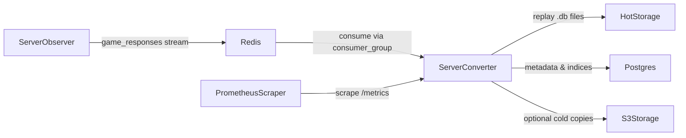

## Server Converter

Daemon service that consumes **Conflict of Nations** game responses from a Redis stream (produced by `server_observer`), converts them into replay files, and persists replay metadata to PostgreSQL with optional S3-compatible cold storage and Prometheus metrics.

This service is typically deployed as part of the wider **Conlyse** stack together with:

- `server_observer` (Rust observer)
- `services/api` (Conlyse API)
- `apps/desktop` (Conlyse desktop client)

---

### Features

- **Redis stream consumer**: Reads game response events from a Redis stream (e.g. `game_responses`) using consumer groups.
- **Replay generation**: Uses the `conflict-interface` library to create and append to replay databases stored on disk.
- **Hot & cold storage**:
  - Hot storage: local filesystem directory for active and completed replay `.db` files.
  - Optional cold storage: S3-compatible object store for durable long-term storage.
- **PostgreSQL metadata**: Writes and updates replay metadata in a dedicated `replays` database.
- **Prometheus metrics**: Exposes operational metrics over HTTP for scraping.
- **Docker-ready**: Multi-stage Dockerfile and a `docker-compose.yml` for local or production-like deployments.

---

### Architecture Overview

At a high level, the data and control flow look like this:

- `server_observer` records games and publishes processed responses to a Redis stream.
- `server_converter`:
  - Consumes batches of messages from the Redis stream.
  - Translates responses into replay updates using the `conflict-interface` replay system.
  - Writes/updates replay `.bin` files in hot storage.
  - Optionally mirrors or finalizes replay files to S3-compatible storage.
  - Updates replay metadata rows in PostgreSQL.
- A Prometheus-compatible metrics endpoint is exposed for monitoring.




For a broader view of how this fits into the project, see the root [README](../../README.md) and the [Server Observer README](../server_observer/README.md).

---

### Installation

In most deployments, you run `server_converter` through Docker / Docker Compose (see below). For local development or running it directly on a host, you can install it as a Python package.

#### Prerequisites

- Python **3.12+**
- Access to:
  - A PostgreSQL instance for the `replays` database.
  - A Redis instance with streams enabled.
  - Optionally, an S3-compatible object store (Hetzner, MinIO, etc.) if cold storage is enabled.

#### Editable install from repository root

From the repository root:

```bash
cd /path/to/ConflictInterface

# Create and activate a virtualenv (recommended)
python -m venv .venv
source .venv/bin/activate

# Install packages including tools needed for server_converter
pip install -e ".[tools-server-converter]"
```

This installs the `server-converter` console script, which you can invoke as:

```bash
server-converter path/to/config.json
```

---

### Configuration

`server_converter` is configured via a **JSON configuration file** passed as the first CLI argument:

```bash
server-converter config.json
```

Two example configurations are provided:

- Local / generic example: [config.example.json](./config.example.json)
- Docker / Compose-oriented example: [config.docker.json](./config.docker.json)

The top-level schema matches `ServerConverterConfig` in `src/config.py`:

```json
{
  "redis": { ... },
  "storage": { ... },
  "database": { ... },
  "batch_size": 10,
  "check_interval_seconds": 5,
  "metrics_port": 8001
}
```

#### `redis` (RedisConfig)

Controls how the converter connects to and consumes from Redis:

- `**host**` (`str`, default `"localhost"`): Redis host.
- `**port**` (`int`, default `6379`): Redis port.
- `**db**` (`int`, default `0`): Logical Redis database index.
- `**password**` (`str|null`, optional): Password for Redis if authentication is enabled.
- `**stream_name**` (`str`, default `"game_responses"`): Name of the Redis stream containing game responses.
- `**consumer_group**` (`str`, default `"server_converter"`): Redis consumer group for coordinated consumption.
- `**consumer_name**` (`str`, default `"converter_1"`): Consumer name within the consumer group.
- `**batch_size**` (`int`, default `10`): Number of messages to read per batch from Redis.

`consumer_group` and `consumer_name` are important for horizontal scaling: multiple instances can share a group and coordinate consumption.

#### `storage` (StorageConfig)

Controls where replay files are written and whether cold storage is enabled:

- `**hot_storage_dir**` (`str`, required): Filesystem directory for replay `.db` files.
- `**cold_storage_enabled**` (`bool`, default `false`):
  - `false`: Replays remain only in hot storage.
  - `true`: Converter uploads replays to S3-compatible storage.
- `**always_update_cold_storage**` (`bool`, default `true`):
  - `true`: Upload / update cold storage after each create/append and on completion.
  - `false`: Only upload when a replay is explicitly marked as completed.
- `**s3**` (`S3Config`, optional): Required if `cold_storage_enabled` is `true`:
  - `endpoint_url` (`str`): S3-compatible endpoint URL.
  - `access_key` (`str`): Access key ID.
  - `secret_key` (`str`): Secret access key.
  - `bucket_name` (`str`): Target bucket name.
  - `region` (`str`, default `"us-east-1"`): Region string for S3 client.

Example (Docker-style) storage section:

```json
"storage": {
  "hot_storage_dir": "/data/hot_storage",
  "cold_storage_enabled": false,
  "always_update_cold_storage": true,
  "s3": {
    "endpoint_url": "https://your-s3-endpoint.com",
    "access_key": "your-access-key",
    "secret_key": "your-secret-key",
    "bucket_name": "replays",
    "region": "us-east-1"
  }
}
```

#### `database` (DatabaseConfig)

PostgreSQL connection parameters for the replays database:

- `**host**` (`str`, default `"localhost"`): Hostname of the Postgres server.
- `**port**` (`int`, default `5432`): Port for Postgres.
- `**database**` (`str`, default `"replays"`): Database name.
- `**user**` (`str`, default `"postgres"`): Database user.
- `**password**` (`str`, default `""`): Password for the user.

These should align with your Postgres instance or your Docker Compose configuration.

#### Global settings

- `**batch_size**` (`int`, default `10`): Top-level processing batch size; can override the Redis-specific `redis.batch_size` depending on internal logic.
- `**check_interval_seconds**` (`int`, default `5`): How long to sleep between checks for new messages when the stream is idle.
- `**metrics_port**` (`int`, default `8001`): Port on which the Prometheus metrics HTTP server listens.

---

### CLI Usage

The entry point for the service is defined in `src/__main__.py` and exposed via the `server-converter` console script.

#### Basic usage

```bash
server-converter config.json
```

Arguments:

- `**config**` (positional, required): Path to the JSON configuration file.

#### Logging options

- `**-v`, `--verbose**`: Enable verbose logging (`DEBUG` level).
- `**-q`, `--quiet**`: Quiet mode (only `ERROR` level).

If neither flag is provided, the log level defaults to `INFO`.

On startup, the service:

1. Parses the configuration file into a `ServerConverterConfig`.
2. Starts a Prometheus metrics HTTP server on `metrics_port`.
3. Instantiates `ServerConverter` with the loaded configuration.
4. Enters the main processing loop, consuming Redis messages and updating replays until interrupted.

Press `Ctrl+C` to stop the service gracefully.

---

### Docker & Docker Compose

For containerized deployments, this directory includes:

- [Dockerfile](./Dockerfile)
- [docker-compose.yml](./docker-compose.yml)

#### Dockerfile

The `Dockerfile` is a multi-stage build:

- **Builder stage**:
  - Based on `python:3.12-slim`.
  - Installs build dependencies (`build-essential`, `gcc`, `g++`).
  - Copies the Python packages and installs the project in editable mode with the `tools-server-converter` extras.
- **Runtime stage**:
  - Based on `python:3.12-slim` with `libpq5` installed for PostgreSQL.
  - Creates a non-root `converter` user and prepares `/app` and `/data/hot_storage`.
  - Copies installed Python packages and the relevant source tree.
  - Sets `PATH` to include the local user binaries and `PYTHONPATH=/app`.
  - Default `CMD`:
    ```bash
    server-converter /app/config.json -v
    ```

You typically mount your own `config.json` and hot storage volume when running the image.

#### docker-compose.yml

`docker-compose.yml` defines a minimal stack for running `server_converter` together with Postgres and Redis:

- `**postgres**`:
  - Image: `postgres:16-alpine`
  - Env:
    - `POSTGRES_DB=replays`
    - `POSTGRES_USER=converter`
    - `POSTGRES_PASSWORD` (defaults to `changeme` if not overridden)
  - Port mapping: `5432:5432`
  - Healthcheck using `pg_isready`
- `**redis**`:
  - Image: `redis:7-alpine`
  - Command: `redis-server --appendonly yes`
  - Port mapping: `6379:6379`
  - Healthcheck using `redis-cli ping`
- `**server-converter**`:
  - Built from the repository (see `build.context` and `dockerfile` path in the compose file).
  - Depends on `postgres` and `redis` being healthy.
  - Environment (can be overridden via `.env`):
    - `REDIS_HOST=redis`
    - `REDIS_PORT=6379`
    - `POSTGRES_HOST=postgres`
    - `POSTGRES_PORT=5432`
    - `POSTGRES_DB=replays`
    - `POSTGRES_USER=converter`
    - `POSTGRES_PASSWORD` (defaults to `changeme`)
  - Volumes:
    - `./config.json:/app/config.json:ro`
    - `hot-storage:/data/hot_storage`
  - Ports:
    - `8001:8001` (Prometheus metrics endpoint)
  - Restart policy: `unless-stopped`

Example usage:

```bash
cd services/server_converter

# Start stack in background
cp config.docker.json config.json  # or create your own
docker-compose up -d

# Check container status
docker-compose ps

# View logs
docker-compose logs -f server-converter
```

Adjust the volume mounts and environment to match your infrastructure.

---

### Metrics & Monitoring

On startup, `server_converter` calls `prometheus_client.start_http_server(metrics_port)`, exposing a standard `/metrics` endpoint.

- **Default port**: `8001` (configurable via `metrics_port`).
- **Endpoint**: `http://<host>:<metrics_port>/metrics`

You can configure Prometheus to scrape this endpoint and build dashboards or alerts around:

- Processed message counts and throughput.
- Error counters (e.g. failed batches, storage/DB errors).
- Replay counts and active session gauges.

The exact metric names may evolve over time; consult the exported `/metrics` payload when building dashboards.

---

### Storage Layout & Lifecycle

#### Hot storage

Hot storage (configured via `storage.hot_storage_dir`) is where replay `.db` files are written and updated. Typical responsibilities:

- Store in-progress replay databases for active games.
- Retain completed replays for fast access by the API and other tools.

You should ensure:

- Sufficient disk space for your expected replay volume.
- Appropriate backup or snapshot strategy if hot storage is critical.

#### Cold storage (S3-compatible)

If `cold_storage_enabled` is `true` and a valid `s3` configuration is provided, the converter will upload replay data to an S3-compatible bucket:

- With `always_update_cold_storage=true`, uploads occur after each replay create/append and again on completion.
- With `always_update_cold_storage=false`, uploads typically occur only when a replay is finalized.

This allows:

- Offloading old or infrequently accessed replays from local disks.
- Using cheap object storage for long-term retention.

#### PostgreSQL metadata

The Postgres database (typically `replays`) stores:

- Replay metadata and indexing information (e.g. game IDs, players, timestamps).
- Status flags indicating whether a replay is active, completed, or failed.

Downstream services such as the Conlyse API use this metadata to provide filtered replay listings and pre-signed download URLs for stored artifacts.

---

### See Also

- Project root [README](../../README.md) – overall architecture and Docker deployment.
- [Server Observer README](../server_observer/README.md) – how recordings and Redis events are produced.
- [Recording Converter CLI](../../tools/recording_converter/README.md) – convert local recordings into replay files.
- Replay Debug tool (see `tools/replay_debug/README.md`) – interactive replay inspection and debugging.
- Conlyse Desktop [README](../../apps/desktop/README.md) – desktop replay analysis client.

