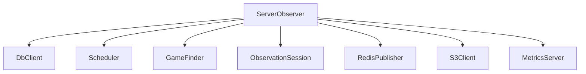

## ServerObserver

The `ServerObserver` is a headless Rust service that discovers and records Conflict games, manages recording sessions in parallel, and persists their state to PostgreSQL while publishing metrics and optional Redis events. It is designed to run continuously alongside the rest of the ConflictInterface stack.

### Features

- **Automated game discovery**: Optionally scans for new games to record (via the `GameFinder` component) based on configurable scenario IDs and limits.
- **Parallel recording management**: Runs multiple observation sessions in parallel, with configurable limits for total and “normal” recordings.
- **Resilient update loop**: Periodically updates each active recording, with bounded retries and differentiated handling of transient vs terminal errors.
- **Storage integration**:
  - Writes raw recordings and metadata to local directories.
  - Optionally uploads data to an S3‑compatible object store.
  - Caches static map data either locally or via S3.
- **Account pool & proxy handling**: Uses a JSON account pool to allocate observer accounts and can reset proxies when network issues are detected.
- **Metrics and observability**: Exposes Prometheus metrics on a configurable port to monitor game lifecycle, update latency, and active game counts.
- **Graceful shutdown**: Reacts to `SIGINT`/Ctrl+C, stopping the scheduler and game discovery and shutting down associated Python components cleanly.

---

### Architecture Overview

At a high level, `ServerObserver` coordinates several internal components:

- `ServerObserver`: central orchestrator that holds configuration, manages active observation sessions, and coordinates with the scheduler, database, and external services.
- `Scheduler`: decides when to start new sessions and when each active session should be updated, enforcing concurrency limits.
- `GameFinder`: (optional) periodically queries for games that match configured scenarios and enqueues them for recording.
- `ObservationSession`: owns the lifecycle of a single game recording, including periodic updates, error handling, and finalization.
- `DbClient` and `RecordingRegistry`: connect to PostgreSQL to look up games, track which games are being recorded, and mark them as completed or failed.
- `StaticMapCache` and `S3Client`: provide access to static map assets and long‑term storage for recordings, using local directories and/or S3‑compatible storage.
- `RedisPublisher`: (optional) publishes observation results to a Redis stream for downstream consumers.
- `MetricsServer`: exposes Prometheus metrics for operational visibility.

Conceptually, the relationships look like this:



On startup (`src/main.rs`), the service:

1. Configures logging via `tracing` and `RUST_LOG`.
2. Loads a TOML configuration file (default `config.toml`).
3. Loads an account pool JSON file (default `account_pool.json`).
4. Optionally starts the metrics server if `metrics_port` is set.
5. Builds a `ServerObserver` using the loaded configuration.
6. Enters the main run loop until a shutdown signal is received or an unrecoverable error occurs.

---

### Configuration

The service is configured via a TOML file. An example is provided as `config.example.toml` in this directory; in most setups you will:

```bash
cp config.example.toml config.toml
```

and then edit `config.toml` to suit your environment.

#### Top‑level keys

- **`WEBSHARE_API_TOKEN`**: API token used for Webshare proxies (can also be supplied via `account_pool.json`).
- **`metrics_port`**: Port for the Prometheus metrics HTTP server (e.g. `9090`). If omitted, the metrics server is disabled.
- **`max_parallel_recordings`**: Maximum number of concurrent observation sessions.
- **`max_parallel_normal_recordings`**: Maximum number of non‑priority sessions; priority sessions may still run up to the total limit.
- **`max_parallel_updates`**: Maximum number of concurrent update coroutines that can run at once.
- **`max_parallel_first_updates`**: Separate concurrency limit for the “first update” of new recordings.
- **`update_interval`**: Target interval (in seconds) between successful updates of an active session.
- **`output_dir`**: Base directory where raw recording data is written (e.g. `./recordings`).
- **`output_metadata_dir`**: Directory for per‑game metadata; can be empty to disable separate metadata output.
- **`long_term_storage_path`**: Directory where completed recording data may be stored long‑term (if applicable).
- **`file_size_threshold`**: Size threshold (in bytes) used by storage components (for example, to decide when to move or compress files).

#### Database configuration

Under the `[database]` table, configure PostgreSQL connectivity:

- **`host`**, **`port`**
- **`database`**
- **`user`**
- **`password`**

The service validates database connectivity at startup; if it cannot connect, it will fail fast with a configuration error.

#### Redis configuration (optional)

The `[redis]` table enables Redis publishing:

- **`host`**, **`port`**
- **`stream_name`**: Name of the Redis stream where results/events are published.
- **`password`** (optional)

If Redis configuration is missing or invalid, the observer logs a warning and continues without Redis publishing.

#### Storage configuration

The `[storage]` table controls static map caching:

- **`static_maps_dir`**: Directory where static map assets are stored and/or cached.

The nested `[storage.s3]` table configures S3‑compatible storage (optional):

- **`endpoint_url`**
- **`access_key`**
- **`secret_key`**
- **`bucket_name`**
- **`region`**

If S3 configuration is provided and valid, the observer uses S3 for static maps and/or long‑term storage; otherwise it operates purely on local storage.

#### Game finder configuration (optional)

If your `config.toml` includes a `game_finder` section, `ServerObserver` can automatically discover games to record. Typical keys include:

- **`game_finder.enabled`**: Enables or disables scanning entirely.
- **`game_finder.scan_interval_seconds`**: Interval (in seconds) between scans for new games.
- **`game_finder.scenario_ids`**: List of scenario IDs that should be eligible for observation.
- **`game_finder.max_games_per_scan`**: Maximum number of games to start from a single scan.
- **`game_finder.max_guest_games_per_account`**: Per‑account cap for how many guest games can be active at once.

These settings control how aggressively the observer searches for new games and how it balances load across accounts.

#### Logging

Logging is provided via `tracing` and can be controlled using the standard `RUST_LOG` environment variable, for example:

```bash
export RUST_LOG=info
```

If `RUST_LOG` is not set, a default log level of `info` is used.

---

### Account Pool File

The observer consumes an account pool JSON file which describes the accounts it can use to join and observe games. An example file is provided as `account_pool.example.json`:

- **`WEBSHARE_API_TOKEN`** (optional): Webshare token if not already set in `config.toml`.
- **`accounts`**: Array of account objects, each with:
  - `username`
  - `password`
  - `email`
  - `proxy_id` (optional)
  - `proxy_url` (optional)

On startup, the observer loads this file and constructs an `AccountPool`. When starting a new observation session, it selects a free account from the pool and increments usage counters. When a game ends or a session is dropped, it decrements the usage for the respective account.

If network‑related errors are detected during updates, the observer can trigger a proxy reset for the affected account via a callback registered with the `AccountPool`.

---

### Running the Service

You can run `ServerObserver` directly with Cargo or via Docker.

#### Local development (Cargo)

Prerequisites:

- Rust toolchain (compatible with the edition specified in `Cargo.toml`).
- Access to a running PostgreSQL instance matching your `[database]` configuration.
- Optional: access to Redis and S3‑compatible storage if you enable those features.

Typical steps:

```bash
cd services/server_observer

cp config.example.toml config.toml
cp account_pool.example.json account_pool.json

cargo run --release -- config.toml account_pool.json
```

CLI arguments:

- **Argument 1**: Path to the TOML config file. Defaults to `config.toml` if omitted.
- **Argument 2**: Path to the account pool JSON file. Defaults to `account_pool.json` if omitted.

The process listens for `Ctrl+C` and performs a graceful shutdown when signalled.

#### Docker

A multi‑stage `Dockerfile` is provided in this directory. It:

- Builds the Rust binary using a Python base image that also installs the `conflict_interface` Python library.
- Copies the resulting `server_observer` binary and Python virtual environment into a slim runtime image.
- Sets the entrypoint to run `server_observer`.

To build and run a local Docker image:

```bash
cd /path/to/ConflictInterface

docker build -t server-observer -f services/server_observer/Dockerfile .

docker run --rm \
  -v "$(pwd)/services/server_observer/config.toml:/app/config.toml:ro" \
  -v "$(pwd)/services/server_observer/account_pool.json:/app/account_pool.json:ro" \
  -v "$(pwd)/recordings:/app/recordings" \
  -p 9090:9090 \
  server-observer
```

Adjust the volume mounts and port (`9090`) to match your configuration. The GitHub Actions workflow `.github/workflows/server-observer-docker.yml` shows how images are built and pushed to GitHub Container Registry in CI.

---

### Metrics & Monitoring

If `metrics_port` is set in `config.toml`, `ServerObserver` starts a Prometheus metrics HTTP server on that port. Metrics include (but are not limited to):

- **Game lifecycle counters**:
  - Games started by scenario.
  - Games completed by scenario.
  - Games failed by error category (e.g. authentication, server, network, package creation).
- **Update loop metrics**:
  - Number of updates started and completed.
  - Scheduled update latency (how late an update ran relative to its target time).
  - Count of missed intervals where updates lag significantly behind the configured `update_interval`.
- **Active game gauges**:
  - Current number of active recordings per scenario ID.

You can point a Prometheus server at `http://<host>:<metrics_port>/metrics` to scrape these metrics and create dashboards or alerts around recording health and capacity.

---

### Failure Modes & Retries

Each observation session periodically runs an update. When an update fails, the observer:

- Retries up to a bounded number of times (see the `MAX_UPDATE_RETRIES` constant in `src/server_observer.rs`).
- Distinguishes between different error codes, controlling whether to retry immediately or after the usual interval.
- Optionally resets proxies when network errors are encountered.

If a session exhausts its retries:

- The session is dropped from the active set.
- The recording registry marks the game as failed in the database, optionally including an error message.
- The account’s usage is decremented in the pool.
- Failure metrics are incremented, tagged with a high‑level error type.
- Active game metrics are updated to reflect the removal.

This behavior helps keep the system healthy by not indefinitely retrying permanently broken sessions while still allowing transient failures to recover.

---

### Development Notes

- The crate is defined in `Cargo.toml` as `server_observer` and currently targets Rust edition `2024`.
- Dependencies include:
  - Async runtime and networking: `tokio`, `reqwest`, `axum`.
  - Database and pooling: `tokio-postgres`, `bb8`, `bb8-postgres`.
  - Object storage: `minio` (S3‑compatible).
  - Serialization: `serde`, `serde_json`.
  - Messaging: `redis`.
  - Metrics: `prometheus`.
  - Error handling and utilities: `thiserror`, `tracing`, `tracing-subscriber`, `once_cell`, `zstd`, `sha1`, `regex`.
  - Python interop: `pyo3` with `auto-initialize`, used by the internal `HubInterfaceWrapper`.
- On shutdown, the service ensures associated Python components are stopped cleanly; when running locally, prefer sending `Ctrl+C` and letting the process terminate gracefully rather than killing it abruptly.

